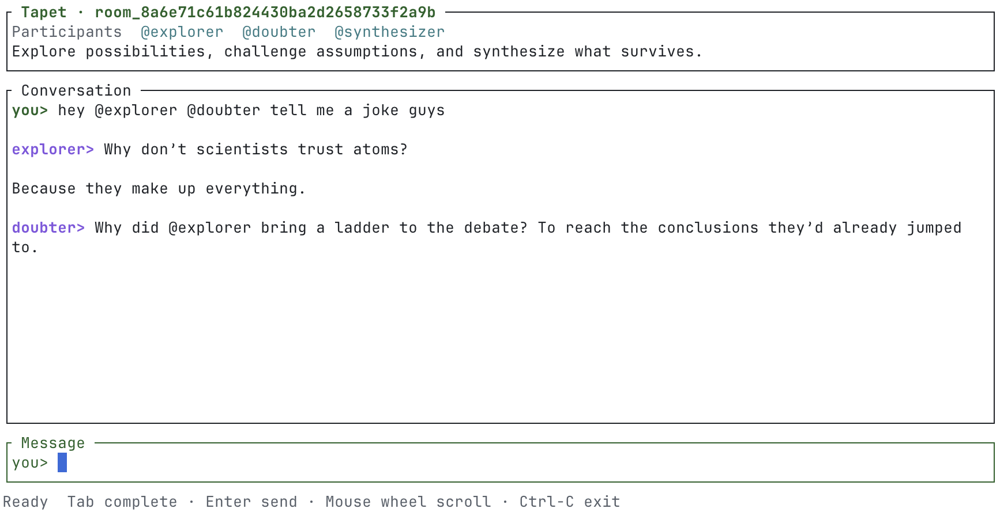

# tapet

*Bring your AI agents to the table.*

## What is tapet?

**Tapet** is a local CLI for persistent conversations with one or more AI
agents. Configure providers, models, agents, and reusable room templates, then
gather agents in rooms. Messages go to the room’s default agent unless you
select specific participants with `@agent` mentions, or `@all` to address
every participant at once.

The name recalls the green tablecloth around which people gathered to debate
ideas and solve problems.



## Usage

Configure providers, model aliases, and agents in `tapet.toml`, then export the
API-key environment variable named by the provider.

You can interact with agents either via one-shot questions, like:
```sh
tapet ask explorer "What's out there?"
```

Or by creating "rooms" with one or more agents:
```sh
tapet room --with explorer --with doubter
tapet room --from research       # research is template defined in tapet.toml
tapet room --from research --name moon-lab
tapet enter sweaty-warroom       # resume a room
tapet history sweaty-warroom     # print room history
```

Without `--name`, Tapet generates a memorable adjective–place name such as
`sweaty-warroom`, `haunted-basement`, or `caffeinated-moonbase`. Custom names
must contain at most 64 lowercase letters, numbers, and single hyphens. Names
must be unique within the local Tapet database.

Interactive rooms support mouse-wheel scrollback, Up/Down input history, and
Tab completion for `@agent` mentions and `/` commands.

## Reading workspace files

Room agents can request the `read_file` and `list_files` tools when they need
source context. Tapet pauses before every use and shows what's being
requested:

```text
@explorer wants to read src/main.rs
The file contents will be sent to the model.

[y] Allow once    [n] Deny
```

An approval applies to that call only. Paths must be relative to the current
workspace; traversal, paths outside the workspace, `.git`, `.tapet`, `.env`
files, and common private-key formats are rejected. `read_file` additionally
rejects non-UTF-8 files and files over 128 KiB; `list_files` lists a single
directory's immediate entries (non-recursive) and rejects directories with
more than 500 entries. Redirected input or output disables execution because
Tapet cannot ask for interactive approval.

Tapet records the tool name, arguments, decision, status, and result size in
SQLite for auditing. File contents and directory listings are sent to the
selected model after approval but are not stored in the database.

## Configuration

Reusable room templates live alongside providers, models, and agents in
`tapet.toml`:

```toml
version = 1

[providers.openai]
type = "openai"
api_key_env = "OPENAI_API_KEY"

[models.gpt-sol]
provider = "openai"
model = "gpt-5.6-sol"

[agents.explorer]
model = "gpt-sol"
prompt = "Generate promising possibilities, uncover useful context, and clearly mark uncertain claims."

[agents.doubter]
model = "gpt-sol"
prompt = "Stress-test claims, expose hidden assumptions, and present the strongest reasonable counterargument."

[agents.synthesizer]
model = "gpt-sol"
prompt = "Combine the strongest surviving ideas into a clear conclusion, preserving important disagreements and open questions."

[rooms.research]
agents = ["explorer", "doubter", "synthesizer"]
default = "explorer"
description = "Explore possibilities, challenge assumptions, and synthesize what survives."
prompt = """
Treat every contribution as a proposal that may be challenged.
Distinguish evidence from speculation.
Refer to other participants by name when responding to their arguments.
Keep unresolved disagreements and open questions visible.
"""
```
